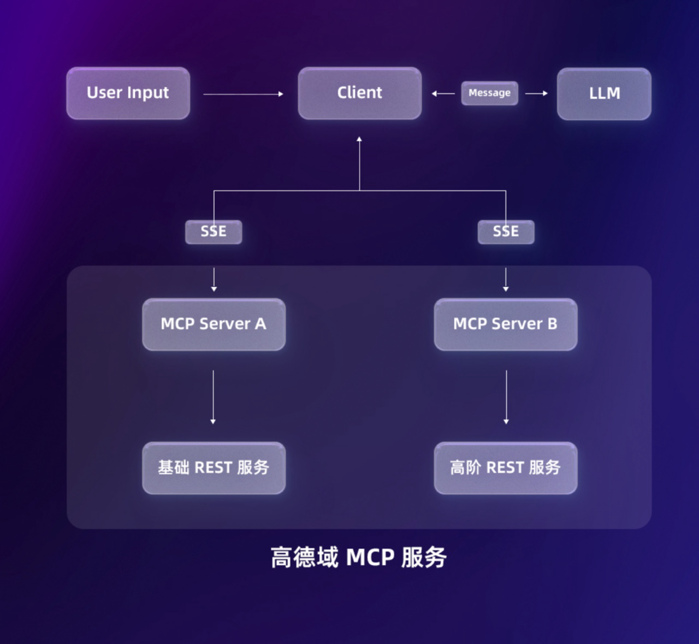

# 🌎小鸟地图🌎
这是一个**旅行助手**，它能帮助您规划旅行路线、酒店推荐等与旅行相关的操作，类似的，你可以询问它**从昆明到北京的路线**，或者**云南大学东陆校区
附近的景点推荐，并给我一些步行的路线规划**，不用担心**天气**问题，它会一并输出。
# 🌟特点🌟
基于 **MCP上下文协议**，本项目调用了**高德地图的MCP**和 **Microsoft的MCP**，以及 **alipay的MCP（目前还在测试阶段）**，它使得智能体功能强大，可以
调用浏览器，快速抓取内容，实现智能体的可视化，高德地图的MCP能让智能体更像一个专业的旅行规划助手，让用户有更好的体验。由于 Openai 强
大的兼容性，我们使用 Openai 的 SDK 来实现了对 deepseek 的接口调用，本项目是使用的 deepseek-chat 模型，让我们的**小鸟地图**功能强大
# 🎭Playwright🎭
Playwright 是一个用于 Web 测试和自动化的框架。它允许使用单一 API 测试Chromium、Firefox和WebKit。Playwright旨在实现持久、强大、可靠且快速的跨浏览器 Web 自动化。
# 功能 #
- **弹性 • 没有不稳定的测试**
自动等待。Playwright 会等待元素变为可操作状态后再执行操作。它还拥有丰富的自省事件。两者的结合消除了人为超时的需要——这是导致测试不稳定的主要原因。
Web 优先断言。Playwright 断言专为动态 Web 而创建。检查会自动重试，直到满足必要条件为止。
跟踪。配置测试重试策略，捕获执行跟踪、视频和屏幕截图以消除缺陷。
- **无取舍 • 无限制**
- 浏览器会在不同的进程中运行不同来源的 Web 内容。Playwright 与现代浏览器的架构保持一致，并在进程外运行测试。这使得 Playwright 摆脱了典型的进程内测试运行器的限制。
多重测试。测试场景涵盖多个标签页、多个来源和多个用户。为不同用户创建具有不同上下文的场景，并在您的服务器上运行，只需一次测试即可完成。
可信事件。悬停元素，与动态控件交互并产生可信事件。Playwright 使用与真实用户无法区分的真实浏览器输入管道。
测试帧，穿透 Shadow DOM。Playwright 选择器可以穿透 Shadow DOM，并允许无缝进入帧。
- **完全隔离 • 快速执行**
浏览器上下文。Playwright 为每个测试创建一个浏览器上下文。浏览器上下文相当于一个全新的浏览器配置文件。这实现了完全的测试隔离，且没有任何开销。创建新的浏览器上下文只需几毫秒。
一次登录。保存上下文的身份验证状态，并在所有测试中重复使用。这样可以绕过每个测试中重复的登录操作，同时实现独立测试的完全隔离。
# 🌎高德MCP🌎 #
实现 LBS 服务与 LLM 更好的交互，高德地图 MCP Server 现已覆盖12大核心服务接口，提供全场景覆盖的地图服务，包括地理编码、逆地理编码、IP 定位、天气查询、骑行路径规划、步行路径规划、驾车路径规划、公交路径规划、距离测量、关键词搜索、周边搜索、详情搜索等。
# 框架图 #

# 使用说明 #
需要创建一个.env文件来保存自己的接口信息，里面的参数包括:
- API_KEY = "Your_API_KEY"
- BASE_URL = "Your_Model_BASE_URL"
- MODEL_NAME = “deep_seek-v3"
- Gao_De_API = "Gaode_MCP_API"
- AMAP_MAPS_API_KEY = "Gaode_MCP_API"
- AP_APP_ID = "alipay_APP"
- AP_APP_KEY = "alipay_KEY"
- AP_PUB_KEY= "alipay_Public_KEY"

配置好参数后就可以使用了
一些运行截图：

优化：前端的插入，以及持续询问的能力（异步操作报错)。
